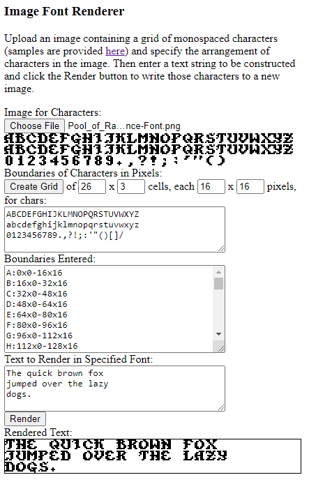

ImageFontRenderer
=================

The code in this repository,
given an image containing a grid of characters in a particular font,
some lines of text specifying the arrangement of characters in that image,
and a string of text to be rendered in the specified font,
writes those characters to a new image and displays it.

